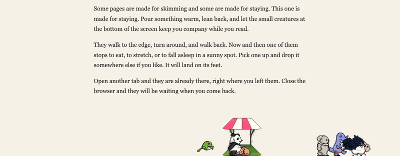
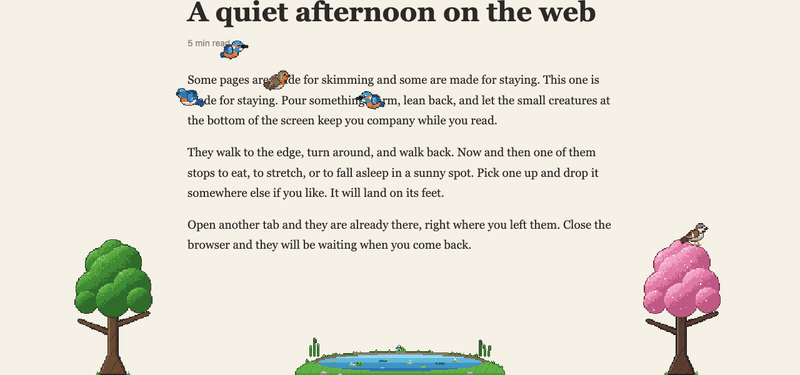
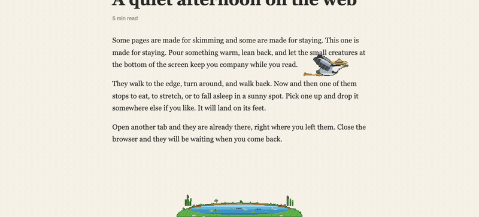
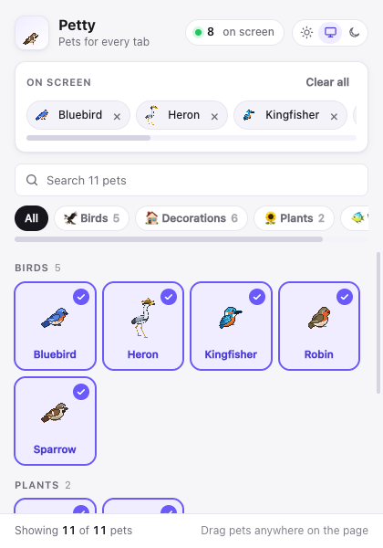
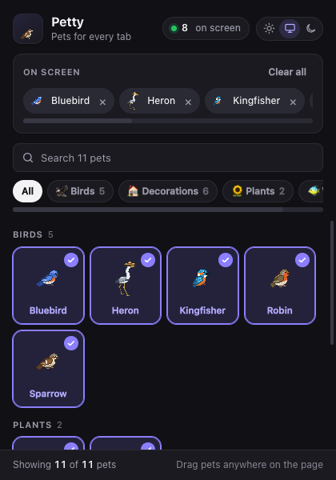

# Petty

Pixel-art birds, trees and ponds that live on top of every browser tab.

[](https://github.com/shanto462/Petty/actions/workflows/ci.yml)
[](https://github.com/shanto462/Petty/actions/workflows/codeql.yml)
[](LICENSE)




## Features

- **11 pixel-art pets, all drawn by Petty itself**: five birds, two trees and four kinds of pond.
- **Birds, trees and ponds**: birds glide around and sit on trees. Songbirds sing on a branch or hop and peck on the ground. The kingfisher dives into a pond, catches a fish and eats it on a branch. Ponds come in four kinds: a lily pond with a frog, a koi pond with a red bridge, a reedy marsh, and a desert oasis whose palm tree birds can sit in.
- **Life in the ponds**: now and then fish of different sizes leap out of the water. When nobody is around the oasis, a mermaid comes up onto her rock to brush her hair, and dives back in when a bird comes close.
- **A heron in a straw hat**: it walks, practices crane-style kung fu, wades into the pond to catch a big carp, and sometimes flies through its own little storm.
- **Alive on every page**: birds fly, land and walk along the bottom of the window; trees and ponds stand on it.
- **Drag and drop**: pick up any pet and drop it somewhere else. A bird flies off; a tree or a pond goes back to the ground.
- **Synced across tabs**: switch tabs and your pets are right where you left them.
- **Random events**: now and then a little storm cloud follows one of your pets around and rains on it.
- **Light, dark or auto** theme in the popup.
- **Private by design**: no tracking, no network requests, no account.





| Light                                                   | Dark                                                        |
| ------------------------------------------------------- | ----------------------------------------------------------- |
|  |  |

## Install

Petty works in Chrome 110 or newer and in other Chromium browsers such as Edge, Brave, Arc and Opera.

### From a release

1. Download `petty-<version>.zip` from the [latest release](https://github.com/shanto462/Petty/releases/latest).
2. Unzip it.
3. Open `chrome://extensions` and turn on **Developer mode** (top right).
4. Click **Load unpacked** and select the unzipped folder.

### From source

```bash
git clone https://github.com/shanto462/Petty.git
cd Petty
npm ci
npm run build
```

Then load the `dist/petty` folder with **Load unpacked**.

## Usage

- Click the Petty icon in the toolbar, then click a pet to add it. Click it again to remove it.
- Drag a pet with the mouse to move it.
- **Clear all** removes every pet. Click it twice to confirm.
- Use the search box or the category chips to find a pet. Scroll the chips with the mouse wheel.
- Pick **Light**, **Auto** or **Dark** with the switch in the top right corner.

Good to know:

- Chrome does not let extensions run on `chrome://` pages or the Chrome Web Store, so pets do not appear there.
- After you update or reload the extension, refresh open tabs to bring the pets back.

## Permissions and privacy

| Permission                     | Why Petty needs it                                                                                      |
| ------------------------------ | ------------------------------------------------------------------------------------------------------- |
| `storage`                      | Remembers which pets you added (synced with your Chrome profile) and where they were.                   |
| `alarms`                       | Schedules the occasional random event, such as the UFO.                                                 |
| Content script on all websites | Draws the pets on the pages you visit. Petty only adds its own elements; it does not read page content. |

Petty collects nothing and sends nothing anywhere. See [PRIVACY.md](PRIVACY.md).

## Development

You need [Node.js](https://nodejs.org/) 22 or newer (see `.nvmrc`).

```bash
npm ci
npx playwright install chromium   # Once, for the end-to-end tests
npm run check                     # Lint, unit tests, build and end-to-end tests
```

| Script                | What it does                                                                   |
| --------------------- | ------------------------------------------------------------------------------ |
| `npm run build`       | Minifies `src/` into `dist/petty/` and writes `dist/petty-<version>.zip`.      |
| `npm run generate`    | Rebuilds `src/shared/catalog.js` after you change `species/` or the sprites.   |
| `npm run sprites`     | Redraws the birds, heron, trees and ponds from the code in `scripts/sprites/`. |
| `npm run lint`        | Runs ESLint and checks formatting with Prettier.                               |
| `npm run format`      | Formats all files with Prettier.                                               |
| `npm test`            | Runs the unit tests.                                                           |
| `npm run test:e2e`    | Loads the built extension in Chromium and tests it with Playwright.            |
| `npm run screenshots` | Regenerates the images in `docs/images` (the GIFs need `ffmpeg`).              |
| `npm run check`       | Runs everything CI runs.                                                       |

For a quick edit loop, load the `src/` folder itself with **Load unpacked**. After a change, click the reload icon on `chrome://extensions` and refresh the page.

### Project layout

```text
src/
  manifest.json
  background/        Service worker: pet roster, saved positions, random events
  content/           Runs inside web pages: physics loop, sprites, dragging, events
  popup/             Toolbar popup
  shared/            Config, physics, species access, generated catalog
  assets/sprites/    Pixel art frames, named <pet>_<animation>-<frame>.png
species/             One JSON definition per pet, compiled into the catalog
scripts/             Build, catalog generator, screenshots, version sync
  sprites/           Draws the birds, heron, trees and ponds in code
test/unit/           Unit tests (node:test)
test/e2e/            End-to-end tests (Playwright)
```

### How it works

- **The visible tab runs the physics.** It steps gravity, walking and wall bounces at a fixed 60 steps per second on `requestAnimationFrame`, which Chrome keeps at full speed for visible pages and pauses for hidden ones.
- **The service worker is the shared store.** It keeps the roster in `chrome.storage.sync` and the last positions in `chrome.storage.session`. The visible tab reports positions once a second and when you leave it. The next tab you open continues from there.
- **Birds have a small brain.** `content/bird-brain.js` picks what a bird does next: cruise, fly to a free perch on a tree, land and peck, or (for the kingfisher) hover over a pond, dive and carry the fish to a perch. The heron wades instead, does kung fu on the ground, and sometimes flies under a storm cloud. Each bird's capabilities in `species/` turn these on. Flight has no gravity; the physics flies the bird straight to the target the brain picks.
- **Why not run physics in the service worker?** Chrome stops extension service workers when they are idle and does not run their timers at a steady rate. Pets used to slow down or freeze whenever the popup was closed. See Chrome's notes on the [service worker lifecycle](https://developer.chrome.com/docs/extensions/develop/concepts/service-workers/lifecycle) and on [timers in service workers](https://developer.chrome.com/docs/extensions/develop/migrate/to-service-workers).

### Adding a pet

1. Add the frames to `src/assets/sprites/`, named `<pet>_<animation>-<n>.png` with `n` starting at 0. You can also draw them in code, like the birds in `scripts/sprites/`. Every pet needs at least `front` and its movement animation (usually `walk`).
2. Add `species/<pet>.json`. Copying an existing file such as `species/sparrow.json` is the easiest start.
3. Run `npm run generate`, then `npm test`. The tests check that every animation a pet uses has frames.
4. Only add art you made yourself or that is licensed for this use. See [NOTICE.md](NOTICE.md). Art you may not ship yet gets a `"source"` in its JSON that is listed in `DISABLED_SOURCES` (`scripts/lib/catalog.mjs`): it then stays out of the catalog and the build.

## Releasing

1. In a pull request, bump the version and update `CHANGELOG.md`:

   ```bash
   npm version minor --no-git-tag-version   # Also updates src/manifest.json
   ```

2. After the pull request is merged, tag the merge commit and push the tag:

   ```bash
   git tag v2.2.0
   git push origin v2.2.0
   ```

The [Release workflow](.github/workflows/release.yml) builds and tests the tag, then publishes `petty-<version>.zip` on the Releases page with a signed build provenance attestation.

## Contributing

Bug reports, ideas and pull requests are welcome. Please read [CONTRIBUTING.md](CONTRIBUTING.md) and the [Code of Conduct](CODE_OF_CONDUCT.md). To report a security problem, follow [SECURITY.md](SECURITY.md).

## Credits

Petty started as an independent browser port of [Bit Therapy](https://github.com/curzel-it) (formerly "Desktop Pets"), the macOS app by Federico Curzel, and much of its pet behavior comes from that project. Petty is not affiliated with or endorsed by its author. The Bit Therapy pets and their pixel art are still in this repository, but they are switched off: the extension does not show or ship them until the author gives permission (see [NOTICE.md](NOTICE.md)).

## License

The source code is released under the [MIT License](LICENSE). The birds, heron, trees, ponds and storm cloud drawn by `scripts/sprites/` are Petty's own art and are MIT licensed too. **The Bit Therapy pixel art in this repository is not covered by the MIT License** and is not part of the extension; see [NOTICE.md](NOTICE.md).
